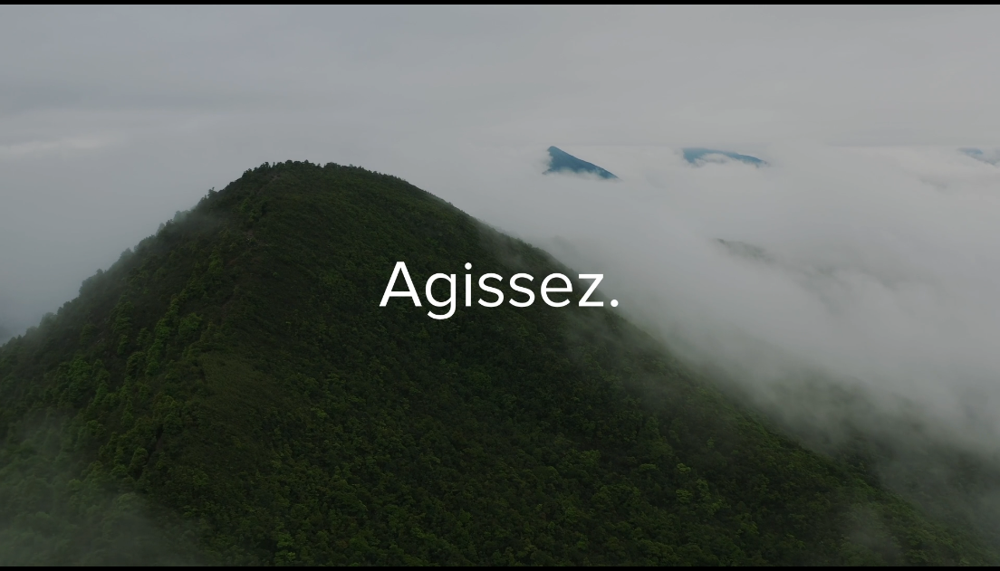
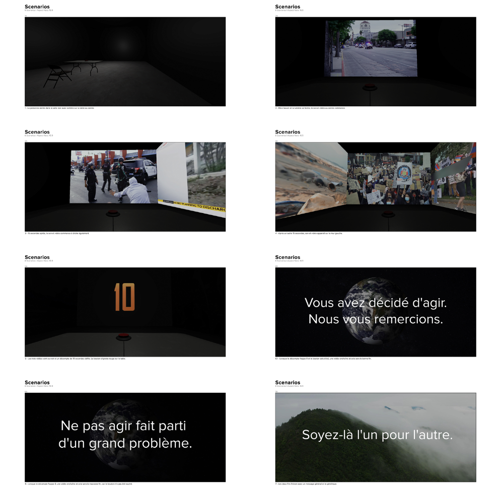
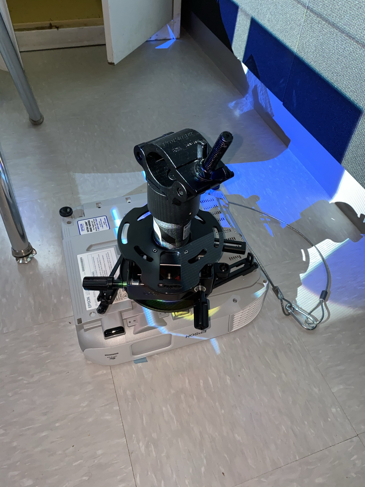
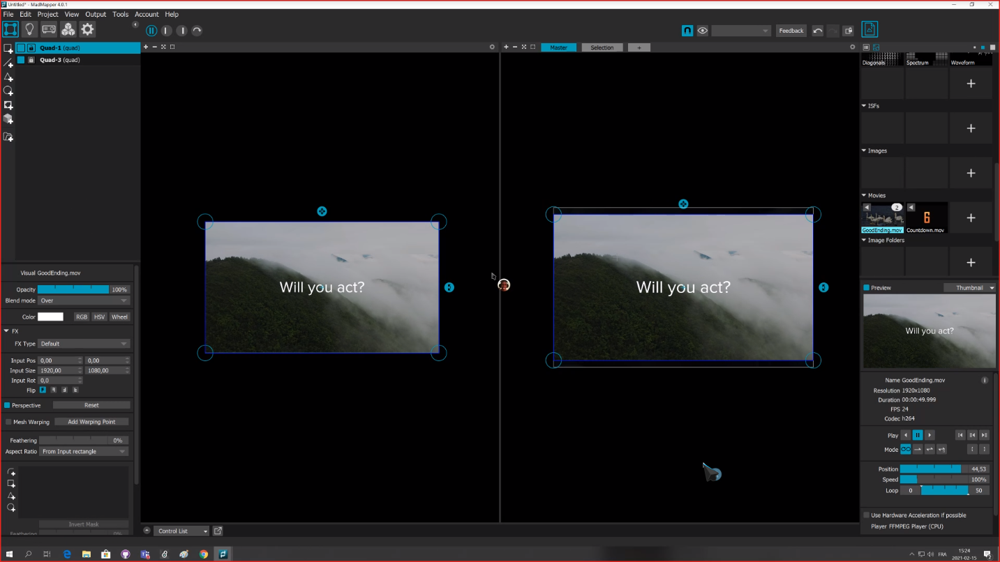

# Journal de "Justin Potvin Ambrocio"

## Table des matières
- [Semaine 0 (25 au 29 janvier)](#Semaine-0-(25-au-29-janvier))
- [Semaine 1 (30 janvier au 5 février)](#Semaine-1-(30-janvier-au-5-février))
- [Semaine 2 (6 au 12 février)](#Semaine-2-(6-au-12-février))
- [Semaine 3 (13 au 19 février)](#Semaine-3-(13-au-19-février))
- [Semaine 4 (20 au 26 février)](#Semaine-4-(20-au-26-février))
- [Semaine 5 (6 au 12 mars)](#Semaine-5-(6-au-12-mars))
- [Semaine 6 (13 au 19 mars)](#Semaine-6-(13-au-19-mars))

---
## Semaine 0 (25 au 29 janvier)

### Résumé des réalisations effectuées
- Vérification du contenu(qualité/utilisation)
- Confirmation si on doit refaire dequoi
- Paufinement du déroulement avec les vidéos

### Image d'une réalisation dont tu es la ou le plus fier

### Est-ce que j'ai accompli l'ensemble des tâches et objectifs que je m'étais fixés pour cette semaine?	
- [ ] Complètement
- [x] Assez
- [ ] Peu
- [ ] Pas du tout

#### Décrivez pourquoi.
J'ai vérifié tout ce que j'avais de besoin pour cette semaine ainsi que le contenu vidéo qu'on utilisera dans notre projet. 

#### S'il y a lieu, qu'allez-vous faire pour remédier à la situation?
x

### Mon projet s'est-il réalisé selon l’échéancier prévu?

- [x] Complètement
- [ ] Assez
- [ ] Un peu
- [ ] Pas tout à fait

#### S'il y a des écarts, décrivez-les.
x

#### S'il y a lieu, qu'allez-vous faire pour remédier à la situation?
x

### Défis pour la prochaine semaine
x

---
## Semaine 1 (30 janvier au 5 février)
### Résumé des réalisations effectuées

Travail sur scénario du projet, planification du projet et aide de tâches.

### Image d'une réalisation dont tu es la ou le plus fier

### Est-ce que j'ai accompli l'ensemble des tâches et objectifs que je m'étais fixés pour cette semaine?

- [x] Complètement
- [ ] Assez
- [ ] Peu
- [ ] Pas du tout

#### Décrivez pourquoi.
 
 Tous les tâches qui ont étés établi pour cette semaine ont été complété et avance notre projet plus qu'assez pour la semaine prochaine.

#### S'il y a lieu, qu'allez-vous faire pour remédier à la situation?

x

### Mon projet s'est-il réalisé selon l’échéancier prévu?

- [x] Complètement
- [ ] Assez
- [ ] Un peu
- [ ] Pas tout à fait

#### S'il y a des écarts, décrivez-les.

x

#### S'il y a lieu, qu'allez-vous faire pour remédier à la situation?

x

### Défis pour la prochaine semaine

Rencontre en équipe au cégep pour discuter des mesures et comment tout va se faire en terme d'équipement et emplacement de ceux-ci.

---
## Semaine 2 (6 au 12 février)
### Résumé des réalisations effectuées
-Assemblage systèmes d'accrochage pour projecteur dans le studio.
-Mesures de cables et emplacements d'équipements dans le studio.

### Image d'une réalisation dont tu es la ou le plus fier

### Est-ce que j'ai accompli l'ensemble des tâches et objectifs que je m'étais fixés pour cette semaine?

- [x] Complètement
- [ ] Assez
- [ ] Peu
- [ ] Pas du tout

#### Décrivez pourquoi.
C'était ce que je voulais faire pour cette semaine et cela menera à l'avancement du projet. 

#### S'il y a lieu, qu'allez-vous faire pour remédier à la situation?
x

### Mon projet s'est-il réalisé selon l’échéancier prévu?

- [x] Complètement
- [ ] Assez
- [ ] Un peu
- [ ] Pas tout à fait

#### S'il y a des écarts, décrivez-les.
x

#### S'il y a lieu, qu'allez-vous faire pour remédier à la situation?
x

### Défis pour la prochaine semaine
Avancement au niveau de projection et montage vidéo

---
## Semaine 3 (13 au 19 février)
### Résumé des réalisations effectuées
Essaies de MadMapper avec les projecteurs et les vidéos dans le petit studio pour voir fonctionnement.

### Image d'une réalisation dont tu es la ou le plus fier

### Est-ce que j'ai accompli l'ensemble des tâches et objectifs que je m'étais fixés pour cette semaine?

- [x] Complètement
- [ ] Assez
- [ ] Peu
- [ ] Pas du tout

#### Décrivez pourquoi.

L'essaie fonctionne de manière souhaité.
 

#### S'il y a lieu, qu'allez-vous faire pour remédier à la situation?
x

### Mon projet s'est-il réalisé selon l’échéancier prévu?

- [x] Complètement
- [ ] Assez
- [ ] Un peu
- [ ] Pas tout à fait

#### S'il y a des écarts, décrivez-les.
x

#### S'il y a lieu, qu'allez-vous faire pour remédier à la situation?
x

### Défis pour la prochaine semaine
Utilisation de MadMapper avec 3 projecteurs et regarder l'intégration vers Max

---
## Semaine 4 (20 au 26 février)
### Résumé des réalisations effectuées

Vidéos longue(5760x1080) pour la projection de vidéo sur MadMapper. 

### Image d'une réalisation dont tu es la ou le plus fier

### Est-ce que j'ai accompli l'ensemble des tâches et objectifs que je m'étais fixés pour cette semaine?

- [x] Complètement
- [ ] Assez
- [ ] Peu
- [ ] Pas du tout

#### Décrivez pourquoi.

C'est la tâche dont je voulais faire pour cette semaine et c'était un défi considérant la taille de la vidéo.
 

#### S'il y a lieu, qu'allez-vous faire pour remédier à la situation?
x

### Mon projet s'est-il réalisé selon l’échéancier prévu?

- [x] Complètement
- [ ] Assez
- [ ] Un peu
- [ ] Pas tout à fait

#### S'il y a des écarts, décrivez-les.
x

#### S'il y a lieu, qu'allez-vous faire pour remédier à la situation?
x

### Défis pour la prochaine semaine
Idéalement projection des vidéos sur les trois murs à partir des projecteurs et MadMapper/Max.

---
## Semaine de rattrapage (27 février au 5 mars)
### Résumé des réalisations effectuées

### Image d'une réalisation dont tu es la ou le plus fier

### Est-ce que j'ai accompli l'ensemble des tâches et objectifs que je m'étais fixés pour cette semaine?

- [ ] Complètement
- [ ] Assez
- [ ] Peu
- [ ] Pas du tout

#### Décrivez pourquoi.
 

#### S'il y a lieu, qu'allez-vous faire pour remédier à la situation?

### Mon projet s'est-il réalisé selon l’échéancier prévu?

- [ ] Complètement
- [ ] Assez
- [ ] Un peu
- [ ] Pas tout à fait

#### S'il y a des écarts, décrivez-les.

#### S'il y a lieu, qu'allez-vous faire pour remédier à la situation?

### Défis pour la prochaine semaine

---
## Semaine 5 (6 au 12 mars)
### Résumé des réalisations effectuées

### Image d'une réalisation dont tu es la ou le plus fier

### Est-ce que j'ai accompli l'ensemble des tâches et objectifs que je m'étais fixés pour cette semaine?

- [ ] Complètement
- [ ] Assez
- [ ] Peu
- [ ] Pas du tout

#### Décrivez pourquoi.
 

#### S'il y a lieu, qu'allez-vous faire pour remédier à la situation?

### Mon projet s'est-il réalisé selon l’échéancier prévu?

- [ ] Complètement
- [ ] Assez
- [ ] Un peu
- [ ] Pas tout à fait

#### S'il y a des écarts, décrivez-les.

#### S'il y a lieu, qu'allez-vous faire pour remédier à la situation?

### Défis pour la prochaine semaine

---
## Semaine 6 (13 au 19 mars)
### Résumé des réalisations effectuées

### Image d'une réalisation dont tu es la ou le plus fier

### Est-ce que j'ai accompli l'ensemble des tâches et objectifs que je m'étais fixés pour cette semaine?

- [ ] Complètement
- [ ] Assez
- [ ] Peu
- [ ] Pas du tout

#### Décrivez pourquoi.
 

#### S'il y a lieu, qu'allez-vous faire pour remédier à la situation?

### Mon projet s'est-il réalisé selon l’échéancier prévu?

- [ ] Complètement
- [ ] Assez
- [ ] Un peu
- [ ] Pas tout à fait

#### S'il y a des écarts, décrivez-les.

#### S'il y a lieu, qu'allez-vous faire pour remédier à la situation?

### Défis pour la prochaine semaine
