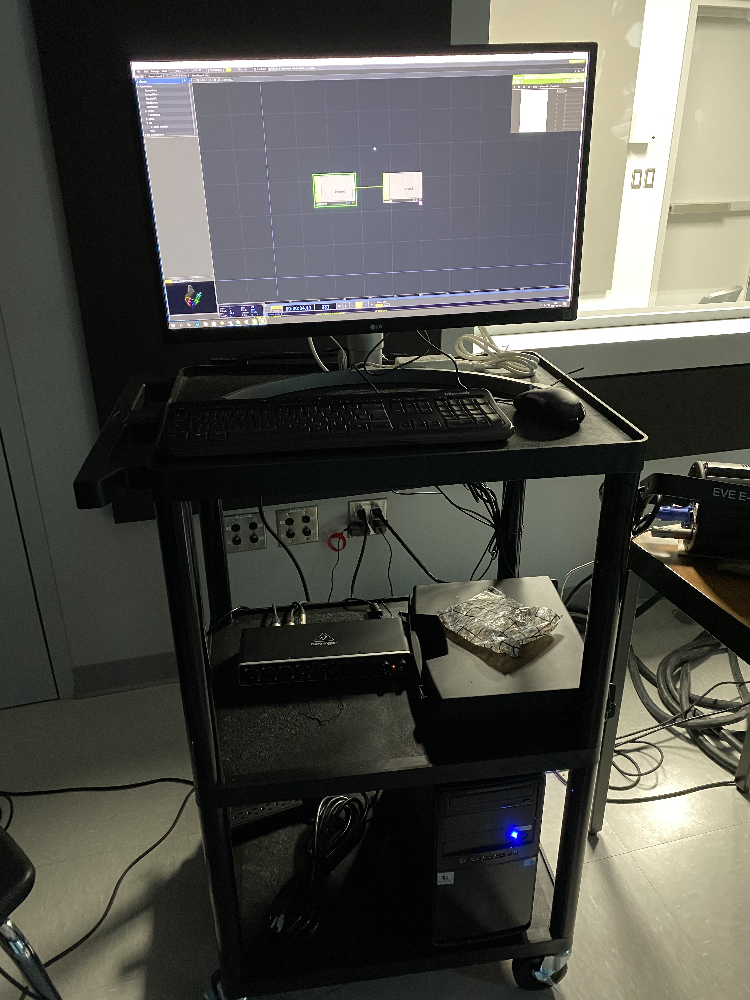
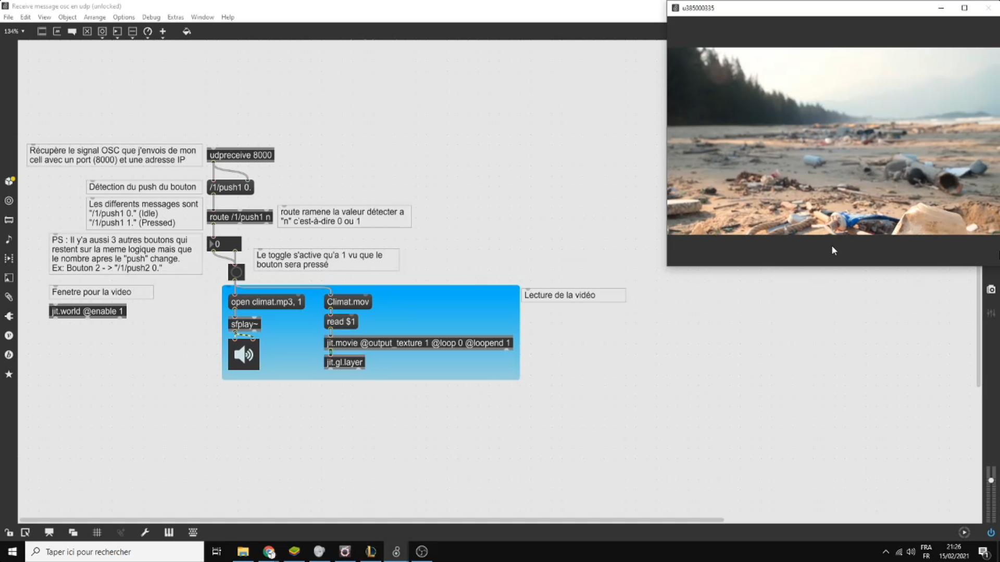

# Journal de Kemyan Amoussou 

## Table des matières
- [Semaine 0 (25 au 29 janvier)](#Semaine-0-(25-au-29-janvier))
- [Semaine 1 (30 janvier au 5 février)](#Semaine-1-(30-janvier-au-5-février))
- [Semaine 2 (6 au 12 février)](#Semaine-2-(6-au-12-février))
- [Semaine 3 (13 au 19 février)](#Semaine-3-(13-au-19-février))
- [Semaine 4 (20 au 26 février)](#Semaine-4-(20-au-26-février))
- [Semaine 5 (6 au 12 mars)](#Semaine-5-(6-au-12-mars))
- [Semaine 6 (13 au 19 mars)](#Semaine-6-(13-au-19-mars))

---
## Semaine 0 (25 au 29 janvier)

### Résumé des réalisations effectuées
- Test pour l'élément a ajouté.
- Léger debut de la préproduction 

### Image d'une réalisation dont tu es la ou le plus fier

### Est-ce que j'ai accompli l'ensemble des tâches et objectifs que je m'étais fixés pour cette semaine?	
- [x] Complètement
- [ ] Assez
- [ ] Peu
- [ ] Pas du tout

#### Décrivez pourquoi.
L'intégration est adéquate. 

#### S'il y a lieu, qu'allez-vous faire pour remédier à la situation?
-

### Mon projet s'est-il réalisé selon l’échéancier prévu?

- [x] Complètement
- [ ] Assez
- [ ] Un peu
- [ ] Pas tout à fait

#### S'il y a des écarts, décrivez-les.
-

#### S'il y a lieu, qu'allez-vous faire pour remédier à la situation?
-

### Défis pour la prochaine semaine
Avancement de la préproduction

---
## Semaine 1 (30 janvier au 5 février)
### Résumé des réalisations effectuées
Travail sur le synopsis, l'intention de départ, le moodboard, les plans et la distributions des taches et rôles. 

### Image d'une réalisation dont tu es la ou le plus fier

### Est-ce que j'ai accompli l'ensemble des tâches et objectifs que je m'étais fixés pour cette semaine?

- [x] Complètement
- [ ] Assez
- [ ] Peu
- [ ] Pas du tout

#### Décrivez pourquoi.
 La préproduction est relativement complete.

#### S'il y a lieu, qu'allez-vous faire pour remédier à la situation?
x

### Mon projet s'est-il réalisé selon l’échéancier prévu?

- [x] Complètement
- [ ] Assez
- [ ] Un peu
- [ ] Pas tout à fait

#### S'il y a des écarts, décrivez-les.
x

#### S'il y a lieu, qu'allez-vous faire pour remédier à la situation?
x

### Défis pour la prochaine semaine
Rencontre au cegep pour planification du prototype en studio 

---
## Semaine 2 (6 au 12 février)
### Résumé des réalisations effectuées
Planification et repérage au petit studio, vérification de la fiabilité du projet et de l'évaluation des taches à accomplir. 

### Image d'une réalisation dont tu es la ou le plus fier

### Est-ce que j'ai accompli l'ensemble des tâches et objectifs que je m'étais fixés pour cette semaine?

- [x] Complètement
- [ ] Assez
- [ ] Peu
- [ ] Pas du tout

#### Décrivez pourquoi.
La petite visite a été suffisante pour confirmer que le projet pourra être à la hauteur de nos espérances.  

#### S'il y a lieu, qu'allez-vous faire pour remédier à la situation?
x

### Mon projet s'est-il réalisé selon l’échéancier prévu?

- [x] Complètement
- [ ] Assez
- [ ] Un peu
- [ ] Pas tout à fait

#### S'il y a des écarts, décrivez-les.
x

#### S'il y a lieu, qu'allez-vous faire pour remédier à la situation?
x

### Défis pour la prochaine semaine
Un suivi sur l'avancement global du projet nottamment (Madmapper et le test avec max en output avec les projecteurs).

---
## Semaine 3 (13 au 19 février)
### Résumé des réalisations effectuées
Test de la logique de Max pour avoir une bonne idée de l'intégration avec la kinect et le bounton.

### Image d'une réalisation dont tu es la ou le plus fier

### Est-ce que j'ai accompli l'ensemble des tâches et objectifs que je m'étais fixés pour cette semaine?

- [x] Complètement
- [ ] Assez
- [ ] Peu
- [ ] Pas du tout

#### Décrivez pourquoi.
Le test avec une signal OSC (de chez moi avec mon cellulaire) et la detection se fait bien et le code est censée et facile a comprendre

#### S'il y a lieu, qu'allez-vous faire pour remédier à la situation?
x

### Mon projet s'est-il réalisé selon l’échéancier prévu?

- [x] Complètement
- [ ] Assez
- [ ] Un peu
- [ ] Pas tout à fait

#### S'il y a des écarts, décrivez-les.
x

#### S'il y a lieu, qu'allez-vous faire pour remédier à la situation?
x

### Défis pour la prochaine semaine
Plus de test avec la kinect et le bouton (nottament le pulse), test avec la lumiere (si elle est livrée).
---
## Semaine 4 (20 au 26 février)
### Résumé des réalisations effectuées

### Image d'une réalisation dont tu es la ou le plus fier

### Est-ce que j'ai accompli l'ensemble des tâches et objectifs que je m'étais fixés pour cette semaine?

- [ ] Complètement
- [ ] Assez
- [ ] Peu
- [ ] Pas du tout

#### Décrivez pourquoi.
 

#### S'il y a lieu, qu'allez-vous faire pour remédier à la situation?

### Mon projet s'est-il réalisé selon l’échéancier prévu?

- [ ] Complètement
- [ ] Assez
- [ ] Un peu
- [ ] Pas tout à fait

#### S'il y a des écarts, décrivez-les.

#### S'il y a lieu, qu'allez-vous faire pour remédier à la situation?

### Défis pour la prochaine semaine

---
## Semaine de rattrapage (27 février au 5 mars)
### Résumé des réalisations effectuées

### Image d'une réalisation dont tu es la ou le plus fier

### Est-ce que j'ai accompli l'ensemble des tâches et objectifs que je m'étais fixés pour cette semaine?

- [ ] Complètement
- [ ] Assez
- [ ] Peu
- [ ] Pas du tout

#### Décrivez pourquoi.
 

#### S'il y a lieu, qu'allez-vous faire pour remédier à la situation?

### Mon projet s'est-il réalisé selon l’échéancier prévu?

- [ ] Complètement
- [ ] Assez
- [ ] Un peu
- [ ] Pas tout à fait

#### S'il y a des écarts, décrivez-les.

#### S'il y a lieu, qu'allez-vous faire pour remédier à la situation?

### Défis pour la prochaine semaine

---
## Semaine 5 (6 au 12 mars)
### Résumé des réalisations effectuées

### Image d'une réalisation dont tu es la ou le plus fier

### Est-ce que j'ai accompli l'ensemble des tâches et objectifs que je m'étais fixés pour cette semaine?

- [ ] Complètement
- [ ] Assez
- [ ] Peu
- [ ] Pas du tout

#### Décrivez pourquoi.
 

#### S'il y a lieu, qu'allez-vous faire pour remédier à la situation?

### Mon projet s'est-il réalisé selon l’échéancier prévu?

- [ ] Complètement
- [ ] Assez
- [ ] Un peu
- [ ] Pas tout à fait

#### S'il y a des écarts, décrivez-les.

#### S'il y a lieu, qu'allez-vous faire pour remédier à la situation?

### Défis pour la prochaine semaine

---
## Semaine 6 (13 au 19 mars)
### Résumé des réalisations effectuées

### Image d'une réalisation dont tu es la ou le plus fier

### Est-ce que j'ai accompli l'ensemble des tâches et objectifs que je m'étais fixés pour cette semaine?

- [ ] Complètement
- [ ] Assez
- [ ] Peu
- [ ] Pas du tout

#### Décrivez pourquoi.
 

#### S'il y a lieu, qu'allez-vous faire pour remédier à la situation?

### Mon projet s'est-il réalisé selon l’échéancier prévu?

- [ ] Complètement
- [ ] Assez
- [ ] Un peu
- [ ] Pas tout à fait

#### S'il y a des écarts, décrivez-les.

#### S'il y a lieu, qu'allez-vous faire pour remédier à la situation?

### Défis pour la prochaine semaine
