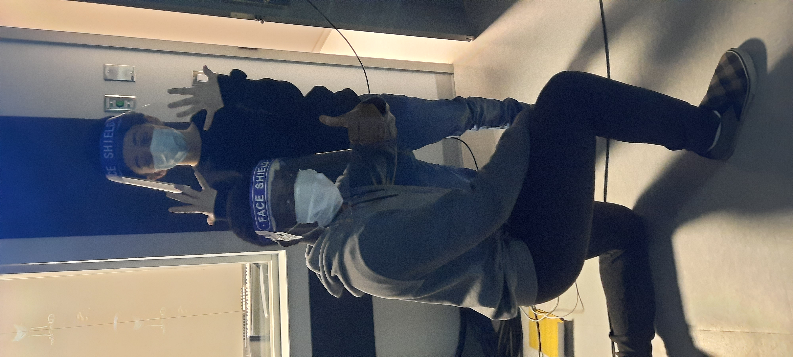
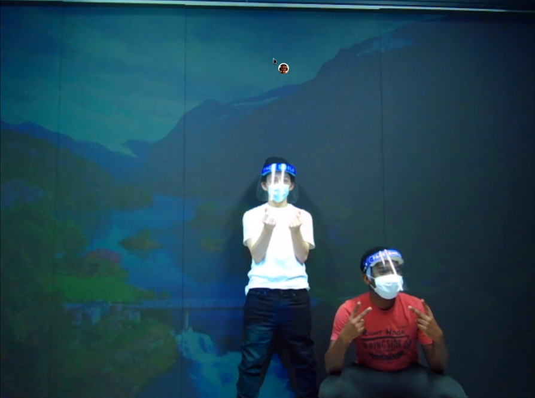
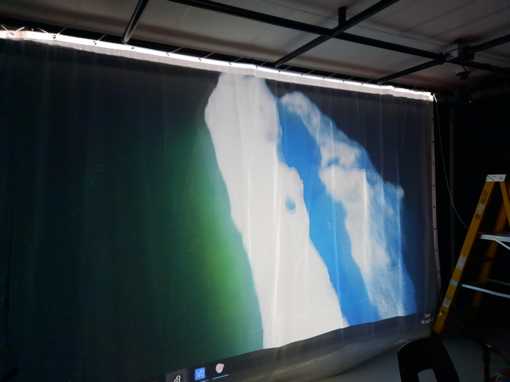
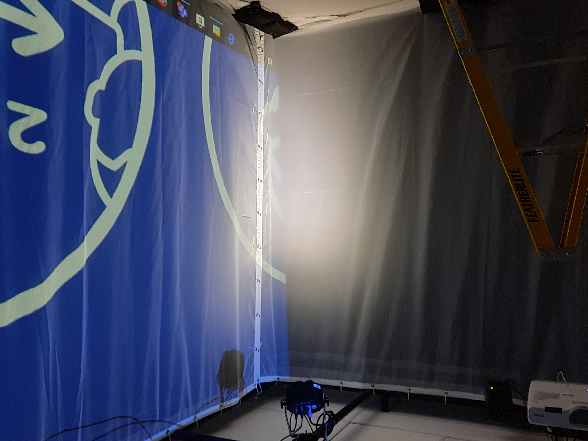
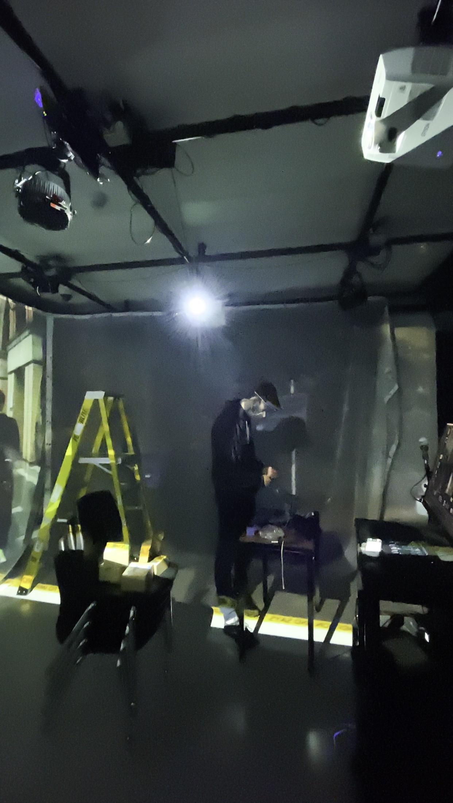
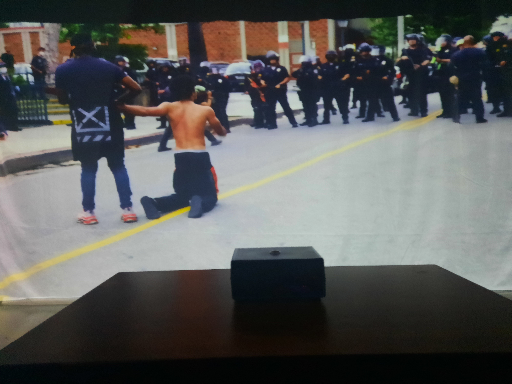

# Journal de Nicolas Reilly

## Table des matières
- [Semaine 0 (25 au 29 janvier)](#Semaine-0-(25-au-29-janvier))
- [Semaine 1 (30 janvier au 5 février)](#Semaine-1-(30-janvier-au-5-février))
- [Semaine 2 (6 au 12 février)](#Semaine-2-(6-au-12-février))
- [Semaine 3 (13 au 19 février)](#Semaine-3-(13-au-19-février))
- [Semaine 4 (20 au 26 février)](#Semaine-4-(20-au-26-février))
- [Semaine 5 (6 au 12 mars)](#Semaine-5-(6-au-12-mars))
- [Semaine 6 (13 au 19 mars)](#Semaine-6-(13-au-19-mars))

---
## Semaine 0 (25 au 29 janvier)

### Résumé des réalisations effectuées
- Retour sur le Unity de la session passée
- Retour sur le projet

### Image d'une réalisation dont tu es la ou le plus fier

### Est-ce que j'ai accompli l'ensemble des tâches et objectifs que je m'étais fixés pour cette semaine?	
- [ ] Complètement
- [ ] Assez
- [x] Peu
- [ ] Pas du tout

#### Décrivez pourquoi.
Nous n'avions pas établi d'objectifs clairs, donc j'ai pris le temps de revoir notre Unity. 

#### S'il y a lieu, qu'allez-vous faire pour remédier à la situation?
Faire des rencontre plus régulière afin de savoir où est rendu tout le monde.

### Mon projet s'est-il réalisé selon l’échéancier prévu?

- [ ] Complètement
- [x] Assez
- [ ] Un peu
- [ ] Pas tout à fait

#### S'il y a des écarts, décrivez-les.

#### S'il y a lieu, qu'allez-vous faire pour remédier à la situation?

### Défis pour la prochaine semaine
- Commencer la productivité pour le projet.
- Commencer le patcher Max 

---
## Semaine 1 (30 janvier au 5 février)
### Résumé des réalisations effectuées
- Création d'un prototype Max pour activer une vidéo et audio à l'aide de la barre d'espace
- Horaire de réunion d'équipe établi 

### Image d'une réalisation dont tu es la ou le plus fier

### Est-ce que j'ai accompli l'ensemble des tâches et objectifs que je m'étais fixés pour cette semaine?

- [ ] Complètement
- [x] Assez
- [ ] Peu
- [ ] Pas du tout

#### Décrivez pourquoi.
 Pour cette semaine, l'important c'était que je me remette dans les bases de Max8 et de faire un prototype pour le bouton.

#### S'il y a lieu, qu'allez-vous faire pour remédier à la situation?

### Mon projet s'est-il réalisé selon l’échéancier prévu?

- [x] Complètement
- [ ] Assez
- [ ] Un peu
- [ ] Pas tout à fait

#### S'il y a des écarts, décrivez-les.

#### S'il y a lieu, qu'allez-vous faire pour remédier à la situation?

### Défis pour la prochaine semaine
- Élaborer le patcher Max 
- Aller au collège pour les bases du petit studio avec Cédrick

---
## Semaine 2 (6 au 12 février)
### Résumé des réalisations effectuées
- Mon équipe et moi sommes allés au collège lundi pour faire des test dans le petit studio
- Avancement du patcher Max

### Image d'une réalisation dont tu es la ou le plus fier

### Est-ce que j'ai accompli l'ensemble des tâches et objectifs que je m'étais fixés pour cette semaine?

- [ ] Complètement
- [x] Assez
- [ ] Peu
- [ ] Pas du tout

#### Décrivez pourquoi.
 Le but de cette semaine était de se faire une idée de quoi notre projet allait avoir l'air en studio et d'avancer le patcher Max pour les vidéos.

#### S'il y a lieu, qu'allez-vous faire pour remédier à la situation?

### Mon projet s'est-il réalisé selon l’échéancier prévu?

- [x] Complètement
- [ ] Assez
- [ ] Un peu
- [ ] Pas tout à fait

#### S'il y a des écarts, décrivez-les.

#### S'il y a lieu, qu'allez-vous faire pour remédier à la situation?

### Défis pour la prochaine semaine
- Avancer le patcher Max
- Aller au studio lundi

---
## Semaine 3 (13 au 19 février)
### Résumé des réalisations effectuées
Je suis allée au petit studio lundi et mardi pour avancer notre installation. On a installé les haut-parleurs et les projecteurs au plafond et ils sont fonctionnels. Nous avons aussi déplacé le chariot pc dans la régie.

### Image d'une réalisation dont tu es la ou le plus fier

### Est-ce que j'ai accompli l'ensemble des tâches et objectifs que je m'étais fixés pour cette semaine?

- [x] Complètement
- [ ] Assez
- [ ] Peu
- [ ] Pas du tout

#### Décrivez pourquoi.
 Cette semaine, notre but était d'avancer l'installation de notre projet dans le petit studio et selon moi, nous avons très bien avancé.

#### S'il y a lieu, qu'allez-vous faire pour remédier à la situation?

### Mon projet s'est-il réalisé selon l’échéancier prévu?

- [x] Complètement
- [ ] Assez
- [ ] Un peu
- [ ] Pas tout à fait

#### S'il y a des écarts, décrivez-les.

#### S'il y a lieu, qu'allez-vous faire pour remédier à la situation?

### Défis pour la prochaine semaine
- Finaliser les éléments manquant pour le prototype.
- Avancer le projet en espace. 
---
## Semaine 4 (20 au 26 février)
### Résumé des réalisations effectuées
- On a installé le tissu de projection sur un mur.  
- On a fait fonctionné le bouton avec Max8.
- On a fait fonctionné la kinect avec Max8.
### Image d'une réalisation dont tu es la ou le plus fier

### Est-ce que j'ai accompli l'ensemble des tâches et objectifs que je m'étais fixés pour cette semaine?

- [x] Complètement
- [ ] Assez
- [ ] Peu
- [ ] Pas du tout

#### Décrivez pourquoi.
 Nous avons bien avancé notre installation et notre projet avance selon notre échéance.

#### S'il y a lieu, qu'allez-vous faire pour remédier à la situation?

### Mon projet s'est-il réalisé selon l’échéancier prévu?

- [x] Complètement
- [ ] Assez
- [ ] Un peu
- [ ] Pas tout à fait

#### S'il y a des écarts, décrivez-les.

#### S'il y a lieu, qu'allez-vous faire pour remédier à la situation?

### Défis pour la prochaine semaine
- Pour la prochaine semaine, nous allons intaller les lumières au plafond et faire des test avec qlc+.
- Avancer le patcher Max8.
- Test avec MadMapper. 
---
## Semaine de rattrapage (27 février au 5 mars)
### Résumé des réalisations effectuées
- Installation de la deuxième toile.
- Ajustement de la position des haut-parleurs.

### Image d'une réalisation dont tu es la ou le plus fier

### Est-ce que j'ai accompli l'ensemble des tâches et objectifs que je m'étais fixés pour cette semaine?

- [x] Complètement
- [ ] Assez
- [ ] Peu
- [ ] Pas du tout

#### Décrivez pourquoi.
 Il ne reste pas grand chose à installer donc on aura le temps de tout finir à temps.

#### S'il y a lieu, qu'allez-vous faire pour remédier à la situation?

### Mon projet s'est-il réalisé selon l’échéancier prévu?

- [x] Complètement
- [ ] Assez
- [ ] Un peu
- [ ] Pas tout à fait

#### S'il y a des écarts, décrivez-les.

#### S'il y a lieu, qu'allez-vous faire pour remédier à la situation?

### Défis pour la prochaine semaine
- Installer la dernière toile.
- Ajuster les élément au plafond.
---
## Semaine 5 (6 au 12 mars)
### Résumé des réalisations effectuées
- Installation de la troisième toile.
- Ajustement de la position des projecteurs, lumières et kinect.
- Déplacement du PC dans la régie.
- Recablage

### Image d'une réalisation dont tu es la ou le plus fier

### Est-ce que j'ai accompli l'ensemble des tâches et objectifs que je m'étais fixés pour cette semaine?

- [x] Complètement
- [ ] Assez
- [ ] Peu
- [ ] Pas du tout

#### Décrivez pourquoi.
 Il ne reste que l'organisation des cables à faire pour la semaine prochaine, donc je considère que j'ai bien fait ma partie.

#### S'il y a lieu, qu'allez-vous faire pour remédier à la situation?

### Mon projet s'est-il réalisé selon l’échéancier prévu?

- [x] Complètement
- [ ] Assez
- [ ] Un peu
- [ ] Pas tout à fait

#### S'il y a des écarts, décrivez-les.

#### S'il y a lieu, qu'allez-vous faire pour remédier à la situation?

### Défis pour la prochaine semaine
- Finir le ménage des cables.
---
## Semaine 6 (13 au 19 mars)
### Résumé des réalisations effectuées
- J'ai finalisé l'organisation du cablage au plafond et vers l'ordinateur.
- J'ai fait le javascript pour le site web de notre projet.

### Image d'une réalisation dont tu es la ou le plus fier

### Est-ce que j'ai accompli l'ensemble des tâches et objectifs que je m'étais fixés pour cette semaine?

- [x] Complètement
- [ ] Assez
- [ ] Peu
- [ ] Pas du tout

#### Décrivez pourquoi.
 Donc tout le nécessaire a été effectué pour finir notre projet

#### S'il y a lieu, qu'allez-vous faire pour remédier à la situation?

### Mon projet s'est-il réalisé selon l’échéancier prévu?

- [x] Complètement
- [ ] Assez
- [ ] Un peu
- [ ] Pas tout à fait

#### S'il y a des écarts, décrivez-les.

#### S'il y a lieu, qu'allez-vous faire pour remédier à la situation?

### Défis pour la prochaine semaine
Que tout fonctionne bien pour le direct sur youtube.
