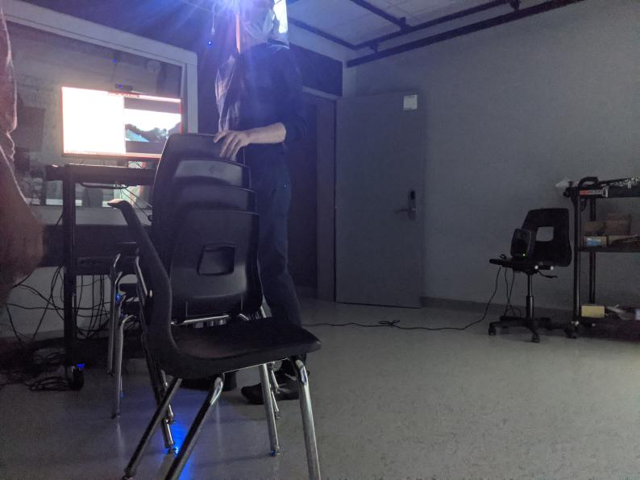
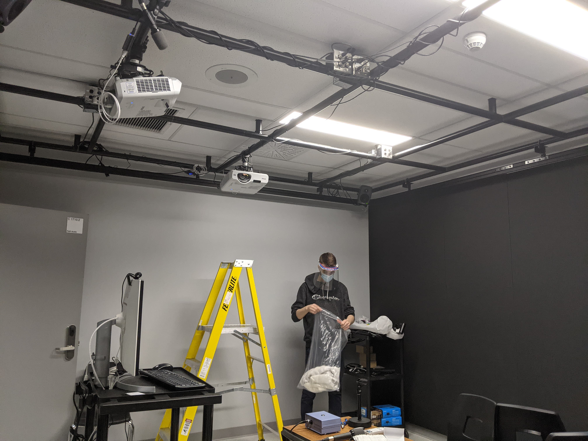
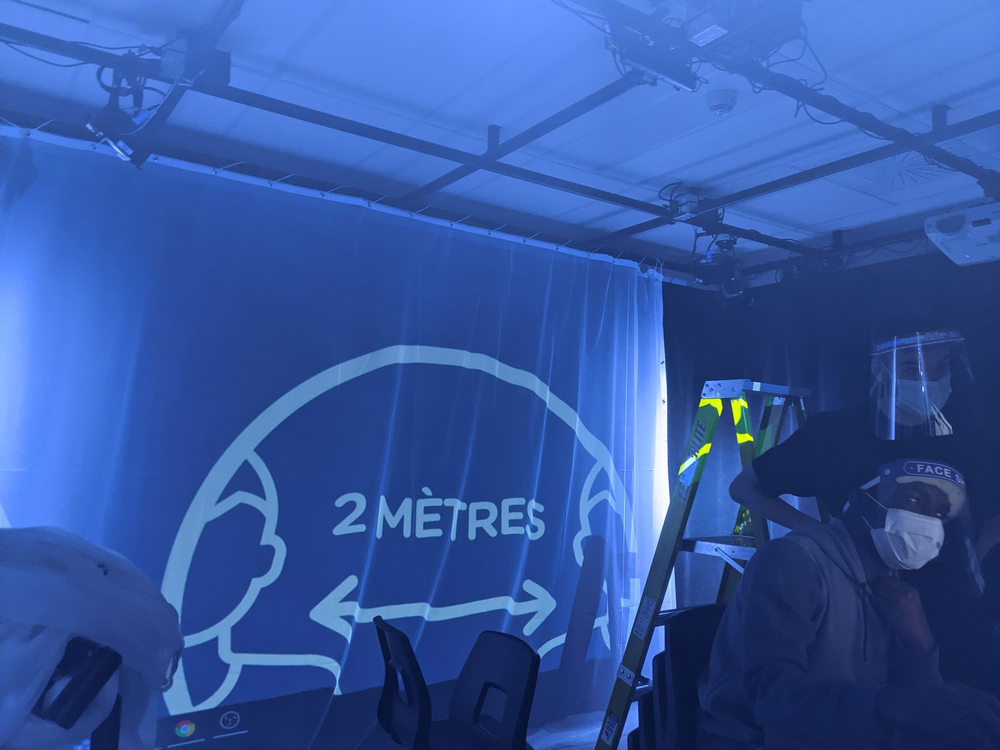

# Journal de "Nicola D'Elia-Zotta"

## Table des matières
- [Semaine 0 (25 au 29 janvier)](#Semaine-0-(25-au-29-janvier))
- [Semaine 1 (30 janvier au 5 février)](#Semaine-1-(30-janvier-au-5-février))
- [Semaine 2 (6 au 12 février)](#Semaine-2-(6-au-12-février))
- [Semaine 3 (13 au 19 février)](#Semaine-3-(13-au-19-février))
- [Semaine 4 (20 au 26 février)](#Semaine-4-(20-au-26-février))
- [Semaine 5 (6 au 12 mars)](#Semaine-5-(6-au-12-mars))
- [Semaine 6 (13 au 19 mars)](#Semaine-6-(13-au-19-mars))

---
## Semaine 0 (25 au 29 janvier)

### Résumé des réalisations effectuées
- Commencer la documentation pour le projet 
- Regarder le matériel multimédia que nous avons déjà

### Image d'une réalisation dont tu es la ou le plus fier

### Est-ce que j'ai accompli l'ensemble des tâches et objectifs que je m'étais fixés pour cette semaine?	
- [ ] Complètement
- [ ] Assez
- [x] Peu
- [ ] Pas du tout

#### Décrivez pourquoi.
Je me remets dans le bain petit à petit.

#### S'il y a lieu, qu'allez-vous faire pour remédier à la situation?

### Mon projet s'est-il réalisé selon l’échéancier prévu?

- [ ] Complètement
- [x] Assez
- [ ] Un peu
- [ ] Pas tout à fait

#### S'il y a des écarts, décrivez-les.

#### S'il y a lieu, qu'allez-vous faire pour remédier à la situation?

### Défis pour la prochaine semaine
Me remettre dans le bain le plus rapidement possible pour être le plus efficace en ce début de session.

---
## Semaine 1 (30 janvier au 5 février)
### Résumé des réalisations effectuées
- Réservation du studio
- Regarder les médias que j'ai
- Faire la préproduction

### Image d'une réalisation dont tu es la ou le plus fier

### Est-ce que j'ai accompli l'ensemble des tâches et objectifs que je m'étais fixés pour cette semaine?

- [ ] Complètement
- [x] Assez
- [ ] Peu
- [ ] Pas du tout

#### Décrivez pourquoi.
 J'ai réserver le studio assez tôt pour pouvoir une idée claire de ce qu'on veut faire en physique ce qui va faire avancer notre projet vers une bonne direction.

#### S'il y a lieu, qu'allez-vous faire pour remédier à la situation?

### Mon projet s'est-il réalisé selon l’échéancier prévu?

- [x] Complètement
- [ ] Assez
- [ ] Un peu
- [ ] Pas tout à fait

#### S'il y a des écarts, décrivez-les.

#### S'il y a lieu, qu'allez-vous faire pour remédier à la situation?

### Défis pour la prochaine semaine
Recommencer la recherche de médias pour les ambiances sonores.

---
## Semaine 2 (6 au 12 février)
### Résumé des réalisations effectuées
Test des haut-parleurs dans le lieu où l'expérience interactive va se passer, recherche pour l'ambiance sonore.

### Image d'une réalisation dont tu es la ou le plus fier

### Est-ce que j'ai accompli l'ensemble des tâches et objectifs que je m'étais fixés pour cette semaine?

- [ ] Complètement
- [x] Assez
- [ ] Peu
- [ ] Pas du tout

#### Décrivez pourquoi.
 Je dois encore faire de la recherche pour le son

#### S'il y a lieu, qu'allez-vous faire pour remédier à la situation?

### Mon projet s'est-il réalisé selon l’échéancier prévu?

- [ ] Complètement
- [x] Assez
- [ ] Un peu
- [ ] Pas tout à fait

#### S'il y a des écarts, décrivez-les.

#### S'il y a lieu, qu'allez-vous faire pour remédier à la situation?

### Défis pour la prochaine semaine
Faire une ambiance sonore pour pouvoir la tester avec le set up son dans le lieu.

---

## Semaine 3 (13 au 19 février)
### Résumé des réalisations effectuées
Création d'un prototype sonore et mise des équipements dans la salle.

### Image d'une réalisation dont tu es la ou le plus fier

### Est-ce que j'ai accompli l'ensemble des tâches et objectifs que je m'étais fixés pour cette semaine?

- [ ] Complètement
- [x] Assez
- [ ] Peu
- [ ] Pas du tout

#### Décrivez pourquoi.
J'ai terminé le prototype.

#### S'il y a lieu, qu'allez-vous faire pour remédier à la situation?

### Mon projet s'est-il réalisé selon l’échéancier prévu?

- [x] Complètement
- [ ] Assez
- [ ] Un peu
- [ ] Pas tout à fait

#### S'il y a des écarts, décrivez-les.

#### S'il y a lieu, qu'allez-vous faire pour remédier à la situation?

### Défis pour la prochaine semaine 
Faire une maquette du son qui marche avec les vidéos.

---
## Semaine 4 (20 au 26 février)
### Résumé des réalisations effectuées
J'ai refais tout le branchement dans le studio pour pouvoir mettre notre ordinateur dans la salle au lieu de la régis, j'ai installé la première toile pour afficher nos vidéos et j'ai installé le "sub-woofer".

### Image d'une réalisation dont tu es la ou le plus fier

### Est-ce que j'ai accompli l'ensemble des tâches et objectifs que je m'étais fixés pour cette semaine?

- [ ] Complètement
- [ ] Assez
- [x] Peu
- [ ] Pas du tout

#### Décrivez pourquoi.
Je me suis concentré sur le prototype qu'il fallait remettre cette semaine donc je n'ai pas eu le temps de faire une maquette pour le son.

#### S'il y a lieu, qu'allez-vous faire pour remédier à la situation?
Recommencer à faire le son. 

### Mon projet s'est-il réalisé selon l’échéancier prévu?

- [ ] Complètement
- [x] Assez
- [ ] Un peu
- [ ] Pas tout à fait

#### S'il y a des écarts, décrivez-les.

#### S'il y a lieu, qu'allez-vous faire pour remédier à la situation?

### Défis pour la prochaine semaine
Mettre tout les toiles et installer l'éclairage dans le studio. 

---
## Semaine de rattrapage (27 février au 5 mars)
### Résumé des réalisations effectuées
Mettre les toile, reinstallation des hauts parleurs, concrétisation du Max.

### Image d'une réalisation dont tu es la ou le plus fier

### Est-ce que j'ai accompli l'ensemble des tâches et objectifs que je m'étais fixés pour cette semaine?

- [ ] Complètement
- [x] Assez
- [ ] Peu
- [ ] Pas du tout

#### Décrivez pourquoi.
 La toile à été installée.

#### S'il y a lieu, qu'allez-vous faire pour remédier à la situation?

### Mon projet s'est-il réalisé selon l’échéancier prévu?

- [ ] Complètement
- [ ] Assez
- [x] Un peu
- [ ] Pas tout à fait

#### S'il y a des écarts, décrivez-les.
Besoin de voir comment le son dans Max fonctionne pour finaliser ambiance sonore.

#### S'il y a lieu, qu'allez-vous faire pour remédier à la situation?
Faire des recherches, demander de l'aide.

### Défis pour la prochaine semaine
Régler les problèmes avec le son et faire le montage de l'ambiance sonore.

---
## Semaine 5 (6 au 12 mars)
### Résumé des réalisations effectuées
Problèmes avec le son réglés et aboutisement du montage de l'ambiance sonore.

### Image d'une réalisation dont tu es la ou le plus fier

### Est-ce que j'ai accompli l'ensemble des tâches et objectifs que je m'étais fixés pour cette semaine?

- [x] Complètement
- [ ] Assez
- [ ] Peu
- [ ] Pas du tout

#### Décrivez pourquoi.
 On a réglé le problème avec le son et on peut jouer l'ambiance sur les trois haut-parleurs.

#### S'il y a lieu, qu'allez-vous faire pour remédier à la situation?

### Mon projet s'est-il réalisé selon l’échéancier prévu?

- [x] Complètement
- [ ] Assez
- [ ] Un peu
- [ ] Pas tout à fait

#### S'il y a des écarts, décrivez-les.

#### S'il y a lieu, qu'allez-vous faire pour remédier à la situation?

### Défis pour la prochaine semaine
Finaliser l'ambiance sonore et faire des paufinements.

---
## Semaine 6 (13 au 19 mars)
### Résumé des réalisations effectuées

### Image d'une réalisation dont tu es la ou le plus fier

### Est-ce que j'ai accompli l'ensemble des tâches et objectifs que je m'étais fixés pour cette semaine?

- [ ] Complètement
- [ ] Assez
- [ ] Peu
- [ ] Pas du tout

#### Décrivez pourquoi.
 

#### S'il y a lieu, qu'allez-vous faire pour remédier à la situation?

### Mon projet s'est-il réalisé selon l’échéancier prévu?

- [ ] Complètement
- [ ] Assez
- [ ] Un peu
- [ ] Pas tout à fait

#### S'il y a des écarts, décrivez-les.

#### S'il y a lieu, qu'allez-vous faire pour remédier à la situation?

### Défis pour la prochaine semaine
