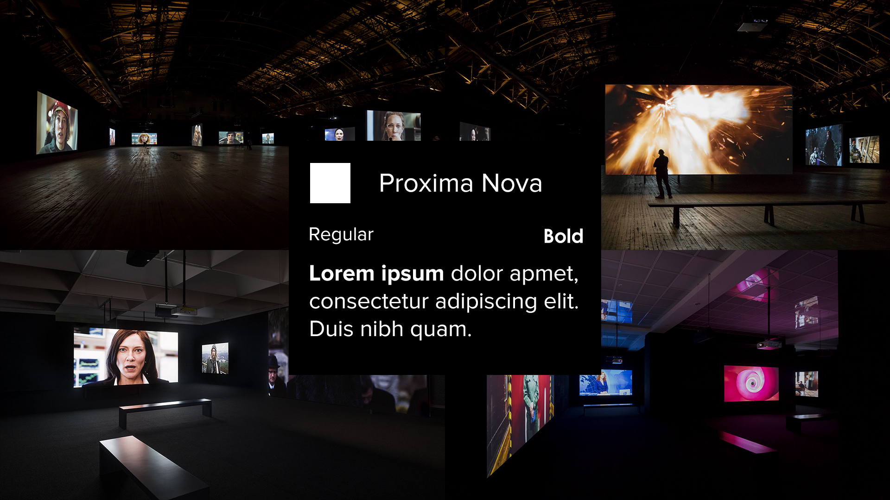
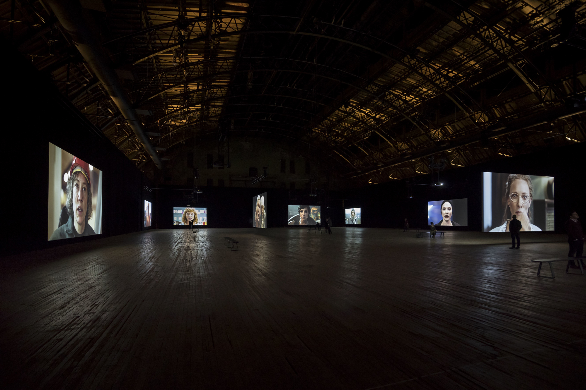
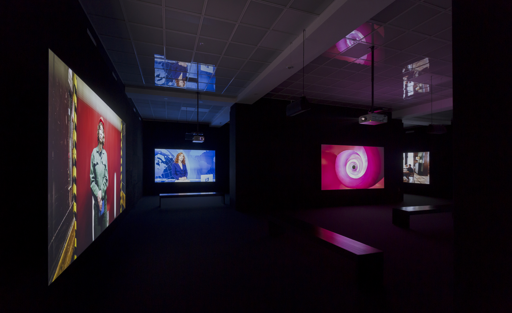
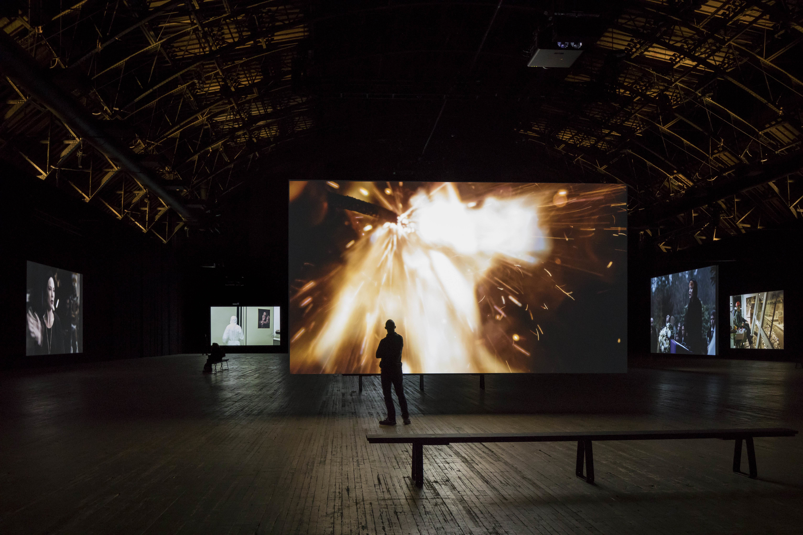
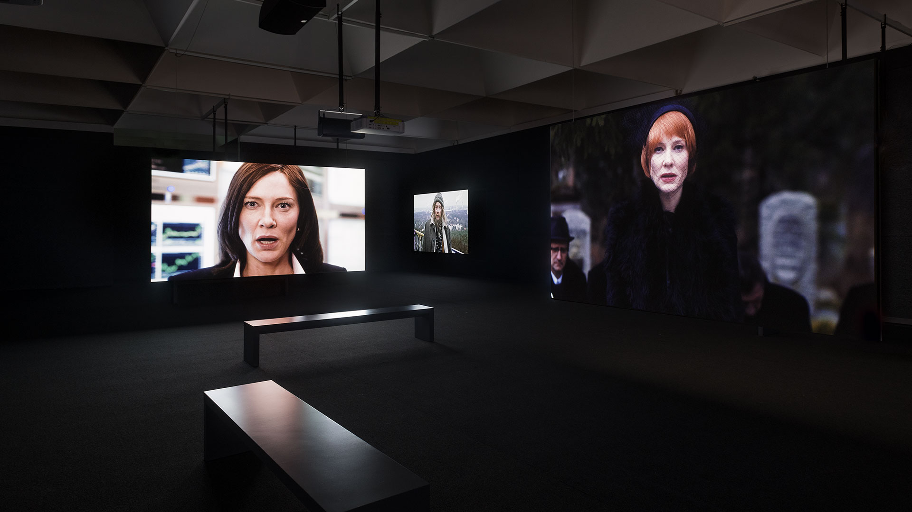
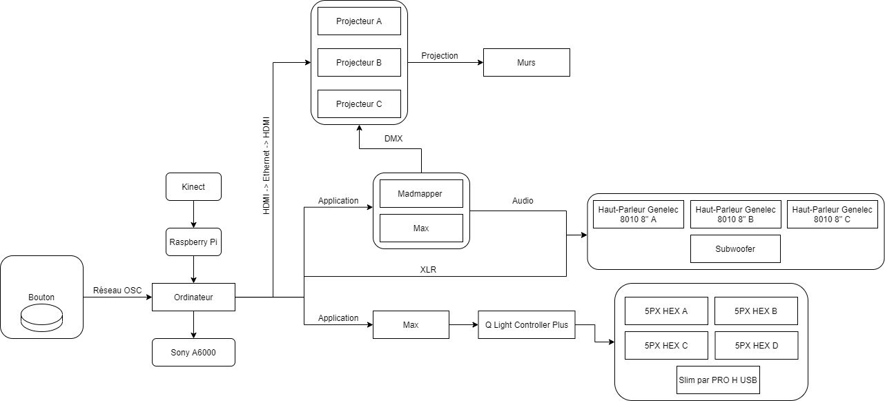
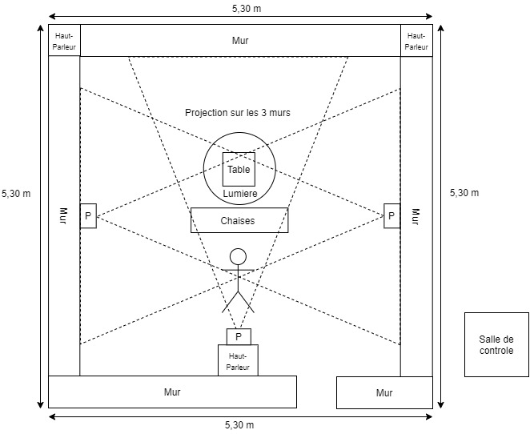
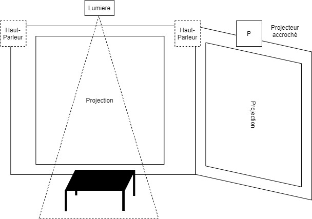

# Préproduction
# Table des matières
1. [Intention ou concept](#Intention-ou-concept)
    - [Synopsis](#Synopsis)
    - [Intention de départ](#Intention-de-départ)
    - [Tableau d'ambiance (*moodboard*)](#Tableau-d'ambiance-(*moodboard*))
    - [Scénario, scénarimage ou document audio/visuel](#Scénario,-scénarimage-ou-document-audio/visuel)
2. [Contenu multimédia à intégrer](#Contenu-multimédia-à-intégrer)
    - [Univers artistique des éléments](#Univers-artistique-des-éléments-centraux)
3. [Planification technique (devis technique)](#Planification-technique-(devis-technique))
    - [Schémas ou plans techniques](#Schémas-ou-plans-techniques)
    - [Schéma de branchement](#Schéma-de-branchement)
    - [Plantation](#Plantation)
    - [Matériaux requis](#Matériaux-de-scénographie-requis)
    - [Équipements requis](#Équipements-requis)
    - [Logiciels requis](#Logiciels-requis)
    - [Ressources humaines requises](#Ressources-humaines-requises)
    - [Ressources spatiales requises (rangement et locaux)](#Ressources-spatiales-requises-(rangement-et-locaux))
4. [Planification de la production (budget et étapes de réalisation)](#Planification-de-la-production-(budget-et-étapes-de-réalisation))
    - [Échéancier global](#Échéancier-global)
    - [Liste des tâches à réaliser](#Liste-des-tâches-à-réaliser)
    - [Rôles et responsabilités des membres de l'équipe](#Rôles-et-responsabilités-des-membres-de-l'équipe))
    - [Moments des rencontres d'équipe](#Moments-des-rencontres-d'équipe)

# Intention ou concept
## Synopsis
_Will You Act_ est une expérience interactive qui donne le choix aux participants d'interagir avec le monde qui leur est présenté. C’est une expérience immersive et interactive qui sensibiliseras contre les injustices envers l’individu avec des projections et le choix de pouvoir « ACT ».

## Intention de départ
Par ce projet, nous souhaitons sensibiliser les participants à penser à tout ce qui pourrait être considéré comme injustice au niveau racial, social. Nous visons donc quelque part un rassemblement de nos participants à comme un semblant de lutte populaire.  

## Tableau d'ambiance

> Exemple d'ambiance sonore
[Background Music - we cannot defend you](https://youtu.be/0rmXbgHskkQ)

> Moodboard

> Une grande inspiration du projet Manifesto de Julian Rosefeldt

[Julian Rosefeldt : Manifesto](https://macm.org/expositions/julian-rosefeldt-manifesto/)

## Scénario, scénarimage ou document audio/visuel
[Scénarios de notre projet](medias/Scenario_pdf.pdf)

# Contenu multimédia à intégrer
## Inventaire du contenu multimédia

- ~ 5 montages d'image pour la promotion/ documentation du projet
- 1 paysages sonores
- 4 montages vidéos pour les projections
- 1 texte de sensibilisation
- 6 modules multimédias (captation des données, interprétation des données, contrôle d'éclairage, *effets audiovisuels*, contrôle vidéo, diffusion et interaction en ligne).

# Planification technique
## Schémas ou plans techniques  

### Schéma de branchement 

### Plantation 

## Matériel de scénographie requis

> Liste des matériaux de scénographie (matériaux de décor) requis ou lien vers un tableur Excel ou document Markdown à part si nécessaire (quantité, spécifications techniques, lien vers fiche technique si applicable, commentaires...)

* Chaise
* Table
* Arrangement d'un bouton ( Artisanalement fait avec du carton et un Arduino )

## Équipements requis
> Liste des équipements requis par département ou lien vers un tableur Excel ou document Markdown à part si nécessaire (quantité, spécifications techniques, lien vers fiche technique si applicable, commentaires...)

* Audio
    * 3 Hauts-parleurs Genelec 8010 8"
    * 3 Cheezboro pour haut-parleurs genelec
    * 1 Carte de son Berhinger U-Phoria 4 in 4 out

* Vidéo
    * 3 Projecteurs short throw, ratio 0.5, 3000 lumens
    * 3 Systèmes d'accrochage pour projecteur vidéo
    * 1 Kinect V1

* Lumière
    * 1 Slim par PRO H USB
    * 1 cinefoil
    * 4 5px Hex
   
* Électricité
    * 1 Extension électrique
    * 8 câbles XLR 25'
    * 8 câbles HDMI 10'
    * 1 transformateur DMX USB vers XLR
    * 3 Adapteurs HDMI-Ethernet (Envoyeur/receveur)
    
* Réseau
    * 6 câbles ethernet 10'
    * 1 transformateur DMX USB vers ethernet
    
* Ordinateur
    * 1 Desktop PC sur un chariot mobile
    * Raspberry Pi ( Fourni )
    
* Autre
    * 3 Toiles projecteur
    * Bouton Arduino ( Fourni ) 
    * Sony A6000 + Kit alimentation + Extendeur réseau HDMI + Carte de capture HDMI
    * 12 safety
    

## Logiciels requis
> Liste des logiciels requis

* [nodeJS 14.15.4 LTS](https://nodejs.org/en/)
* [node-osc](https://github.com/MylesBorins/node-osc)
* [Max 8](https://cycling74.com/products/max)
* [Unity 2019 lts](https://unity.com/)
* [VisualStudioCode](https://code.visualstudio.com/)
* [Arduino](https://www.arduino.cc/)
* [DaVinci Resolve](https://www.blackmagicdesign.com/products/davinciresolve/)
* [Open stage control](https://openstagecontrol.ammd.net/)
* [Reaper](https://www.reaper.fm/)
* [Madmapper](https://madmapper.com/)

## Ressources humaines requises
> Moments et fonctions où une intervention humaine externe à l'équipe est nécessaire et pourquoi. Formaté en liste ou en lien vers un tableur Excel.

* 15 février, TTP, location de matériel 
* 21 février, TTP, retour du matériel

## Ressources spatiales requises (rangement et locaux)

* Petit studio
    * 8 février 
        * Repérage, visualisation de la faisabilité de l'installation 
        * 3 heures
    
# Planification de la production

## Échéancier global
Étapes importantes du projet visualisé dans GitHub (*milestones*):  
https://github.com/NicolasReilly/WillYouAct/milestones

*Dates importantes de diffusion :*
- Pratique générale : 19 mars (toute la journée)
- Début de la diffusion : lundi 22 mars
- Présentation des projets devant public : jeudi 25 mars (soir)

## Liste des tâches à réaliser
Visualisation des tâches à réaliser dans GitHub selon la méthode Kanban:  
https://github.com/NicolasReilly/WillYouAct/projects/1

Inventaire des tâches à réaliser dans GitHub selon le répertoire d'*issues*:  
https://github.com/NicolasReilly/WillYouAct/issues?q=is%3Aopen+is%3Aissue

## Rôles et responsabilités des membres de l'équipe

**Étudiant A** -> *KemyanA.*
- Coordination générale du projet (coordination de l'échéancier, du budget, suivi de la liste des tâches à réaliser, s'assurer de la répartition du rôle et des responsabilités des membres de l'équipe);
- Aide aux différents étudiants pour tout type de taches notamment la programmation du patcher Max et l'intégration de Madmapper.

Liste des tâches dans Git Hub:  
https://github.com/NicolasReilly/WillYouAct/issues/assigned/MoumouK

**Étudiant B** -> *Nico.Reilly* 
- Comité Technique et coordination technique (suivi du devis technique);
- Programmation du patcher Max pour jouer les videos/sons ;

Liste des tâches dans Git Hub:  
https://github.com/NicolasReilly/WillYouAct/issues/assigned/NicolasReilly

**Étudiant C** -> *Nico.Del* 
- Comité Diffusion et coordination de la diffusion (mise en ligne du Site Web, organisation de la plateforme et de l'événement de diffusion);
- Gestion des réservations du studio;
- Gestion des emprunts;
- Production d'ambiance sonore;

Liste des tâches dans Git Hub:  
https://github.com/NicolasReilly/WillYouAct/issues/assigned/shnicovelli

**Étudiant D** -> *JustinP.*
- Coordination artistique;
- Création des textes de sensibilisation;
- Montage des différentes vidéos;
- Création des images pour la promotion du projet;

Liste des tâches dans Git Hub:  
https://github.com/NicolasReilly/WillYouAct/issues/assigned/Vivxds

## Moments des rencontres d'équipe
Quotidien
- **Chaque jour à 13h00 ( ~ 30min - 1heure )**: Rencontre statutaire d'équipe pour régler les urgences / Avancer le projet dans un environnement de travail.

Hebdomadaire
- **Mardi "14"h (environ 1h)** : Rencontre d'équipe avec professeur
- **Vendredi 9h50 (environ 2h)** : Rencontre générale de classe
- **Vendredi 13h (environ 2h)** : Rencontre de mise à jour d'équipe (Journal Web, suivis, mise à jour de l'échéancier, partage des tâches et autres)

Autre: 
- **Jeudi 10h (environ 1h30)** : Comité Diffusion
- **Jeudi 14h (environ 1h30)** : Comité Technique
- **Jeudi 18 mars (Apres-midi, Soirée) : Pratique générale** 
